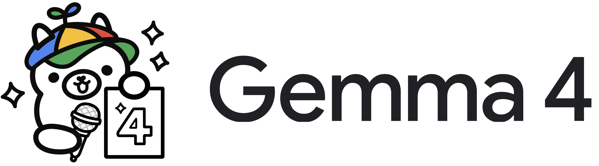
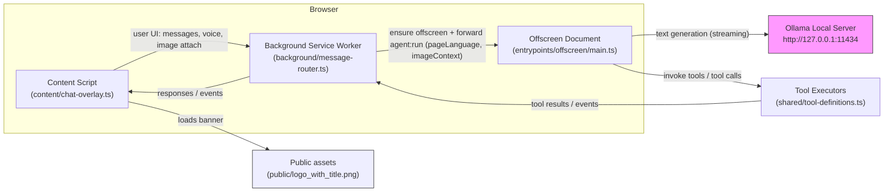

Gemma is a browser extension that runs the Gemma 2 assistant locally via Ollama, providing an in-page conversational AI with voice input, image explanation, and quick action helpers. In this project Gemma is embedded as the local assistant backend (the offscreen agent) that receives page context and image metadata, runs local inference, and streams replies back into the page UI.

## What I built

- A Chrome MV3 extension (built with WXT/Vite) that runs a local Gemma assistant through an Ollama HTTP backend. The extension provides an in-page chat overlay, push-to-talk voice input with live transcription, optional spoken replies, quick action prompts (translate, summarize, reply), and image attach/paste/drop support with local metadata extraction and OCR attempts.
- The architecture is message-driven: the `content` script handles UI and captures page/image context, the `background` service worker routes messages and ensures the `offscreen` document is available, and the `offscreen` agent composes prompts and streams responses from the local Ollama server.

## Use cases

- In-page research assistant: ask questions about the current page, get summaries, or request translations without leaving the tab.
- Accessibility helper: read page content aloud, summarize dense sections, or provide simplified explanations for non-expert users.
- Developer assistance: explain code snippets found on a page, suggest fixes, or generate example usage for APIs seen in documentation.
- Image explanation & annotation: drop or paste an image and ask Gemma to describe the contents, extract text (OCR), or suggest captions and alt text.
- Customer support & writing: draft replies, summarize conversations, or convert long threads into short actionable items.

## Where I have implemented Gemma in this project

- `content/chat-overlay.ts` — the in-page UI: message list, composer, push-to-talk, image attach/drop/paste UI, quick-action buttons, and transient UI state.
- `entrypoints/content.ts` — content-script wiring: voice recognition/synthesis, image preprocessing (metadata + OCR), page-language detection, and sending `agent:run` messages to background.
- `background/message-router.ts` — routes messages between `content` and the `offscreen` document, forwards `pageLanguage` and `imageContext`, and ensures the offscreen agent is available.
- `entrypoints/offscreen/main.ts` — offscreen agent orchestration: system + language prompts, tool wiring, and agent lifecycle (streaming responses back to content).
- `offscreen/model-host.ts` — the local model backend adapter talking to Ollama (`/api/tags`, `/api/generate`) and handling streaming responses.
- `shared/messages.ts` & `shared/models.ts` — typed message contracts and model registry used across content, background, and offscreen.
- `shared/tool-definitions.ts` — tool executor definitions exposing page actions the agent can request.
- `content/gem-icon.ts` and `wxt.config.ts` — launcher icon and web_accessible_resources entries for `public` assets (logo files).
- `public/` — banner and logo assets used by the UI (`logo_with_title.png`, `logo_3.png`).

These files together implement the end-to-end experience: UI capture in the page → routed messages through the background → offscreen agent uses local Ollama (Gemma installed through Ollama) for generation and tool executors to perform page-aware actions.

