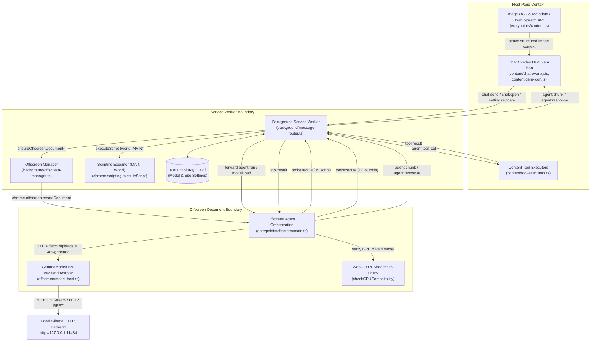
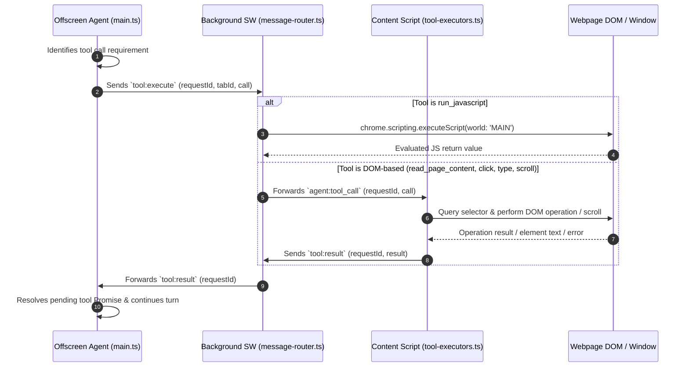
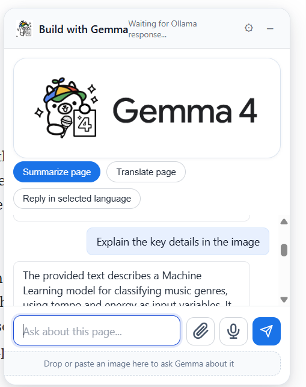

# Gemma Gem — In-Page AI Assistant Powered by Local Gemma 2 & Ollama


**Gemma Gem** is a privacy-first Chrome browser extension (WebExtension Manifest V3) that embeds a local AI assistant directly into host webpages. Powered by Google's Gemma 2 models (`gemma2:2b` / `gemma2:9b`) running via a local [Ollama](https://ollama.com) instance (`http://127.0.0.1:11434`), the extension provides in-page conversational intelligence, push-to-talk voice interactions, automated webpage actions via custom DOM tools, and local image analysis through browser-native OCR and metadata extraction.

Unlike cloud-based browser extensions, Gemma Gem operates entirely on the user's local machine. No page contents, user prompts, image context, or spoken audio leave the browser to external servers.

---

## 1. Key Features

- **In-Page Chat Overlay & Floating Launcher:** Embedded UI overlay ([`content/chat-overlay.ts`](content/chat-overlay.ts)) and interactive floating launcher icon ([`content/gem-icon.ts`](content/gem-icon.ts)) with site-level toggle controls.
- **Local Ollama Inference Streaming:** Connects via REST API to Ollama (`http://127.0.0.1:11434`) for real-time NDJSON token streaming with internal LLM control token sanitization (`<eos>`, `<|think|>`, `<|tool|>`, etc.).
- **Autonomous Page Tools & DOM Automation:** Empowers the AI agent ([`@kessler/gemma-agent`](https://www.npmjs.com/package/@kessler/gemma-agent)) to query, inspect, and interact with live host webpage elements using native tools (`read_page_content`, `click_element`, `type_text`, `scroll_page`, and `run_javascript`).
- **Pseudo-Multimodal Image Pipeline:** For text-only Gemma 2 models, image files attached, dropped, or pasted into the composer undergo local metadata extraction (`createImageBitmap`) and native browser OCR (`window.TextDetector`) to assemble structured prompt context.
- **Push-to-Talk Voice & Speech Output:** Built-in Web Speech API integration (`SpeechRecognition` / `webkitSpeechRecognition`) for hands-free voice prompt entry and markdown-cleansed speech synthesis readout (`SpeechSynthesisUtterance`).
- **Context Snapshotting & Quick Actions:** Captures page metadata, page language, and up to 8,000 characters of inner text on launch, supporting instant one-click quick actions (*Summarize Page*, *Translate Page*, *Reply in Language*).
- **Per-Site Exclusion & Persistence:** Persists model selection (`gemma_selected_model`) and per-site exclusion flags (`gemma_disabled_sites`) in `chrome.storage.local`.

---

## 2. Requirements

### Functional Requirements
- **Page Context Capture:** Automatically capture current URL, title, detected language, and text snapshot on chat initialization.
- **Autonomous Tool Execution:** Allow the AI agent to execute multi-step page inspection and DOM interactions.
- **Local Streaming Response:** Stream LLM token responses incrementally into the chat UI overlay without UI thread blocking.
- **Image Context Assembly:** Extract image dimensions, MIME type, file size, and OCR text without transmitting pixels to external services.
- **Voice I/O:** Record voice input continuously into the prompt composer and speak final responses when enabled.
- **Site Exclusions:** Allow users to disable or re-enable the extension per site domain.

### Non-Functional Requirements
- **Privacy & Data Security:** Zero cloud telemetry or external LLM API dependencies; all network calls target `127.0.0.1:11434`.
- **Manifest V3 Compliance:** Abide by Chrome MV3 security policies, non-persistent background service worker constraints, and Content Security Policy rules.
- **Responsiveness & Threading:** Offload AI orchestration and network polling to an offscreen document to prevent UI input lag in host web pages.

---

## 3. System Architecture & Process Topology

WebExtension Manifest V3 prohibits persistent background pages and restricts network requests / DOM manipulation inside background service workers. Gemma Gem resolves this using a **3-Tier Isolated Process Architecture** connected via Chrome Extension IPC (`chrome.runtime.sendMessage` and `chrome.tabs.sendMessage`).



### Component Roles & Responsibilities

| Component | Execution Context | Key Files | Core Responsibilities |
| :--- | :--- | :--- | :--- |
| **Content Script** | Host Webpage DOM (Isolated World) | [`entrypoints/content.ts`](entrypoints/content.ts)<br>[`content/chat-overlay.ts`](content/chat-overlay.ts)<br>[`content/tool-executors.ts`](content/tool-executors.ts) | Manages Shadow-DOM style UI overlay, captures page context, extracts image metadata & native browser OCR, runs Web Speech API, executes DOM tools (`read_page_content`, `click_element`, `type_text`, `scroll_page`). |
| **Background Service Worker** | Ephemeral MV3 Service Worker | [`entrypoints/background.ts`](entrypoints/background.ts)<br>[`background/message-router.ts`](background/message-router.ts)<br>[`background/offscreen-manager.ts`](background/offscreen-manager.ts) | Central IPC routing hub, manages offscreen document lifecycle, persists settings in `chrome.storage.local`, executes `run_javascript` tool in `MAIN` webpage execution world via `chrome.scripting`. |
| **Offscreen Document** | Hidden Extension HTML Page (`offscreen.html`) | [`entrypoints/offscreen/main.ts`](entrypoints/offscreen/main.ts)<br>[`offscreen/model-host.ts`](offscreen/model-host.ts) | Runs long-lived agent loop using `@kessler/gemma-agent`, interfaces with Ollama HTTP server, checks WebGPU hardware support (`shader-f16`), parses NDJSON stream chunks, strips LLM control tokens. |
| **Ollama Local Server** | Host System Process | Local Installation (`127.0.0.1:11434`) | Houses Gemma 2 weights, runs GPU/CPU model inference, exposes `/api/tags` and `/api/generate` REST endpoints. |

---

## 4. System Flow & Request Lifecycle

### 4.1 End-to-End Chat & Token Streaming Flow

```text
User Types Prompt
   │
   ▼
Content Script (entrypoints/content.ts)
   │  1. Captures Page Context (URL, Title, Language, 8k char snapshot)
   │  2. Sends `chat:send` via chrome.runtime.sendMessage
   ▼
Background Service Worker (background/message-router.ts)
   │  3. Invokes ensureOffscreenDocument()
   │  4. Forwards `agent:run` with tabId to Offscreen Document
   ▼
Offscreen Document (entrypoints/offscreen/main.ts)
   │  5. Assembles System & Language Prompts (Date, Time, Country, Page Snapshot)
   │  6. Instantiates / reuses Agent instance with turn history
   │  7. GemmaModelHost sends POST to http://127.0.0.1:11434/api/generate (stream: true)
   ▼
Local Ollama Backend
   │  8. Streams NDJSON response chunks
   ▼
GemmaModelHost (offscreen/model-host.ts)
   │  9. Reads stream reader, parses NDJSON line-by-line
   │ 10. Sanitizes LLM special tokens (<eos>, <|think|>, <|tool|>, etc.)
   │ 11. Dispatches onChunk callback to Agent
   ▼
Offscreen Agent -> Background SW -> Content Script
   │ 12. Sends `agent:chunk` messages down IPC pipeline
   │ 13. ChatOverlay appends text tokens / thinking steps dynamically
   │ 14. Final response triggers TTS speech output (if enabled)
```

### 4.2 Round-Trip Tool Execution Mechanics

When Gemma 2 decides to invoke a page action (e.g., `read_page_content`, `click_element`, or `run_javascript`):



---

## 5. Design & Low-Level Architecture (LLD)

### 5.1 `GemmaModelHost` Adapter Pattern
`GemmaModelHost` ([`offscreen/model-host.ts`](offscreen/model-host.ts)) implements `@kessler/gemma-agent`'s `ModelBackend` interface, wrapping Ollama's REST endpoints while matching expected agent contract capabilities.

```typescript
export class GemmaModelHost implements ModelBackend {
  private currentModelId: ModelId | null = null
  private currentOllamaModel: string | null = null
  private abortController: AbortController | null = null

  async load(modelId: ModelId): Promise<void>
  async generateRaw(prompt: string, options?: GenerateOptions): Promise<string>
  countTokens(text: string): number
  isLoaded(): boolean
  abort(): void
}
```

Key Responsibilities:
- **Model Resolution (`resolveOllamaModel`):** Queries `GET /api/tags` and matches installed tag names (`gemma2:2b`, `gemma2`, `gemma2:latest`, `gemma2:9b`) against model registry candidates.
- **NDJSON Stream Decoding (`generateRaw`):** Uses `TextDecoder` and buffered line splitting to decode Ollama's newline-delimited JSON stream without buffer fragmentation issues.
- **Control Token Stripping (`stripSpecialTokens`):** Removes LLM internal control tokens (`<eos>`, `<bos>`, `<end_of_turn>`, `<start_of_turn>`, `<|tool|>`, `<|think|>`, `<|channel|>`) before tokens reach the UI chunk handler.

### 5.2 Typed Message Protocol
All inter-process communication across Content Script, Background Worker, and Offscreen Document is governed by a strict discriminated union (`Message` in [`shared/messages.ts`](shared/messages.ts)):

- **Content → Background:** `chat:send`, `chat:open`, `chat:stop`, `settings:update`, `context:clear`, `model:switch`, `tool:result`.
- **Background → Offscreen:** `agent:run`, `model:load`, `model:switch`, `settings:update`, `tool:result`.
- **Offscreen → Background:** `tool:execute`, `agent:chunk`, `agent:response`, `model:status`, `gpu:warning`.
- **Background → Content:** `agent:chunk`, `agent:response`, `agent:tool_call`, `model:status`, `gpu:warning`.

### 5.3 Tool Registry & Capability Matrix

| Tool Name | Scope / Target | Executed In | Description & Parameters |
| :--- | :--- | :--- | :--- |
| `read_page_content` | DOM Element | Content Script | Extracts plain text or raw HTML from targeted CSS selector (defaults to `body`, capped at 64k chars). |
| `click_element` | DOM Element | Content Script | Triggers programmatic `.click()` on targeted CSS selector. |
| `type_text` | Input Element | Content Script | Focuses input, updates `.value`, and dispatches synthetic `input` and `change` events. |
| `scroll_page` | Window Scroll | Content Script | Scrolls window vertically by requested pixel amount (`direction: "up" \| "down"`). |
| `run_javascript` | Page JS Context | Background (`MAIN` World) | Evaluates arbitrary JavaScript in host page window via `chrome.scripting.executeScript`. |

---

## 6. Tech Stack & Justification

| Technology | Role | Rationale & Justification |
| :--- | :--- | :--- |
| **TypeScript (v5.9)** | Primary Language | Provides compile-time safety across multi-process Chrome extension message schemas and tool argument contracts. |
| **WXT Framework (v0.20)** | Extension Build Tooling | Standardized WebExtension Manifest V3 build system, providing cross-browser bundlers (Chrome, Firefox), HMR, and offscreen document entrypoint management. |
| **Ollama (Local Server)** | LLM Inference Engine | Standardized local REST backend supporting GGUF Gemma 2 quantizations with high performance, streaming APIs, and zero external cloud dependency. |
| **@kessler/gemma-agent** | Agent Orchestrator | Lightweight agent framework providing multi-turn conversation history management, tool call parsing, iteration limits, and system prompt formatting. |
| **Marked (v17.0)** | Markdown Renderer | Converts Gemma's markdown output into sanitized HTML inside the chat overlay. |
| **Web Speech API** | Voice Input / Output | Native browser APIs (`SpeechRecognition` & `SpeechSynthesis`) providing zero-dependency voice input and audio readout. |

---

## 7. Key Engineering Decisions & Trade-Offs

### 1. Offscreen Document vs. Background Service Worker for Inference
- **Problem:** Chrome MV3 Service Workers are ephemeral—Chrome terminates them after short periods of inactivity. Furthermore, Service Workers lack access to Web Workers, full DOM, and certain persistent streaming capabilities.
- **Solution:** Create an Offscreen Document (`ensureOffscreenDocument()`) on extension startup.
- **Trade-off:** Adds an extra async IPC hop (Content → Background → Offscreen), but guarantees persistent agent loops, continuous fetch streaming from Ollama, and full WebGPU diagnostic API access.

### 2. Pseudo-Multimodal Pipeline for Text-Only Gemma 2 Models
- **Problem:** Standard Gemma 2 models pulled via Ollama are text-only; transmitting raw image base64 bytes to Ollama causes model failure or ignored media.
- **Solution:** Process images client-side before sending prompts. [`entrypoints/content.ts`](entrypoints/content.ts) extracts image dimensions using `createImageBitmap` and attempts local OCR via `window.TextDetector`. The result is formatted into structured text context appended to the user prompt.
- **Trade-off:** Does not provide full visual embedding capabilities (e.g. object spatial localization), but allows text-only Gemma 2 to answer queries about uploaded document scans, screenshots, and diagrams with zero cloud dependencies.

### 3. Dual Execution Worlds for Tools (`ISOLATED` vs. `MAIN`)
- **Problem:** Content scripts execute in Chrome's `ISOLATED` world. They can manipulate DOM elements but cannot inspect page-defined JavaScript variables or invoke global window functions.
- **Solution:** DOM tools (`click_element`, `type_text`, `read_page_content`) execute directly in the Content Script. The `run_javascript` tool is routed through Background Worker using `chrome.scripting.executeScript({ world: 'MAIN' })`.
- **Trade-off:** `MAIN` world script execution presents security risks if untrusted prompts are executed. However, restricting arbitrary JS execution to explicit agent tool calls controlled by user settings maintains safety.

### 4. Hybrid Page Context Snapshotting
- **Problem:** Giving the LLM zero initial context requires extra tool round-trips for basic questions. Giving the LLM the entire page HTML causes token overflow and context window exhaustion.
- **Solution:** On prompt send, capture a lightweight page snapshot: title, URL, detected language, and inner text truncated to 8,000 characters. If the snapshot is truncated, the agent system prompt instructs it to call `read_page_content` for specific sections.
- **Trade-off:** Uses ~2,000 tokens of the 8,192 context limit up front, but eliminates 1-2 tool roundtrips for 90% of user queries.

---

## 8. Edge Cases & Resilience

- **Ollama Access / CORS Block (HTTP 403):** If Ollama rejects requests due to missing WebExtension origins, `formatOllamaAccessError` intercepts HTTP 403 and formats an explicit troubleshooting guide directing the user to start Ollama with `OLLAMA_ORIGINS=chrome-extension://*`.
- **WebGPU Shader Compatibility Guard:** Prior to model loading, `checkGPUCompatibility()` queries `navigator.gpu` and verifies hardware support for `shader-f16`. If unsupported, a user warning is dispatched to the chat UI.
- **Tool Execution Timeout Protection:** Every tool execution dispatch registers a 120-second timeout (`TOOL_EXECUTION_TIMEOUT`). If a tool fails to return a result (e.g. infinite loop in injected JS or dead DOM element), the pending promise is rejected and cleaned from `pendingToolResults`.
- **Extension Context Invalidation:** Content script wraps background messaging in `safeSend()`. If the user updates or reloads the extension while a page is open, IPC failures are caught gracefully, displaying *"Extension reloaded — refresh the page"* instead of throwing uncaught exceptions.
- **Unsupported Tool Handling:** Screenshots (`take_screenshot`) are intercepted in `message-router.ts`, returning a clean error object stating unsupported status under Gemma 2 text-only mode rather than breaking the agent loop.

---

## 9. Performance & Optimization

- **Stream Buffer Parsing:** `GemmaModelHost.generateRaw()` processes incoming binary streams using line-buffered chunk parsing (`indexOf('\n')`). This prevents chunk splitting corruption across JSON boundary boundaries during fast LLM output.
- **DOM Snapshots & Selector Limits:** Page inner text snapshots are hard-capped at 8,000 chars; `read_page_content` output is hard-capped at 64,000 chars. This protects against browser memory spikes on massive web pages.
- **TTS Markdown Cleaning:** `stripMarkdown()` removes code blocks (` ``` `), image references, and bold/italic syntax prior to invoking `window.speechSynthesis`, preventing speech synthesis from reading raw formatting characters aloud.

---

## 10. Security & Privacy Model

- **100% Local Privacy Boundary:** All prompt context, DOM content, and uploaded images remain entirely on-device. Network requests strictly target `http://127.0.0.1:11434`.
- **Content Security Policy (CSP):** `wxt.config.ts` enforces `script-src 'self' 'wasm-unsafe-eval'; object-src 'self'`, preventing loading of remote scripts.
- **Host Domain Disabling:** Users can disable the extension per-site. Site keys (`location.hostname`) are stored in `chrome.storage.local` under `gemma_disabled_sites`, hiding UI overlays and disabling message listeners.

---

## 11. Local Setup & Development

### Prerequisites
- **Node.js** (v18+ recommended)
- **pnpm** (v8+ recommended)
- **Ollama** installed and running locally ([ollama.com](https://ollama.com))

### Step 1: Install Ollama & Model
Start Ollama with cross-origin access enabled for Chrome extensions, then pull the target Gemma 2 model:

```bash
# Allow extension origins
OLLAMA_ORIGINS="chrome-extension://*" ollama serve

# In a separate terminal, pull Gemma 2 2B (or 9B)
ollama pull gemma2:2b
```

### Step 2: Clone & Install Dependencies
```bash
git clone https://github.com/AnilKumt/contextual-browser-agent.git
cd contextual-browser-agent
pnpm install
```

### Step 3: Run Development Server
```bash
# Run Chrome development build with WXT live reload
pnpm dev

# Or for Firefox
pnpm dev:firefox
```

### Step 4: Load Unpacked Extension in Chrome
1. Open Chrome and navigate to `chrome://extensions/`.
2. Enable **Developer mode** (top-right toggle).
3. Click **Load unpacked**.
4. Select the `.output/chrome-mv3` directory generated in the project root.
5. Click the Gem floating launcher icon on any webpage to begin!

### Build Commands Reference
```bash
pnpm build         # Development build (.output/chrome-mv3)
pnpm build:prod    # Production build (.output/chrome-mv3)
pnpm compile       # TypeScript check (tsc --noEmit)
pnpm zip           # Package extension into zip archive
```

---

## 12. Project Structure

```text
d:\gemma-gem\
├── entrypoints/
│   ├── background.ts           # Service worker entrypoint initializing message router & offscreen doc
│   ├── content.ts              # Content script entrypoint handling speech, OCR, and overlay instantiation
│   └── offscreen/
│       ├── index.html          # Hidden offscreen document HTML shell
│       └── main.ts             # Offscreen agent orchestrator (@kessler/gemma-agent loop)
├── background/
│   ├── message-router.ts       # Central IPC message routing & tool dispatch logic
│   └── offscreen-manager.ts    # Creation & lifecycle management of Chrome offscreen document
├── content/
│   ├── chat-overlay.ts         # Shadow DOM UI overlay, message renderer, & composer
│   ├── gem-icon.ts             # Floating gem launcher icon & progress ring rendering
│   └── tool-executors.ts       # Local DOM tool implementations (read, click, type, scroll)
├── offscreen/
│   └── model-host.ts           # GemmaModelHost adapter connecting to local Ollama HTTP API
├── shared/
│   ├── logger.ts               # Environment-aware logging utility
│   ├── messages.ts             # Strictly typed IPC message definitions
│   ├── models.ts               # Model registry definitions (Gemma 2 2B / 9B)
│   └── tool-definitions.ts     # Schema definitions for agent tools
├── public/                     # Static icons, logos, and WASM binaries
├── package.json                # Project dependencies & scripts manifest
├── tsconfig.json               # TypeScript compiler configuration
└── wxt.config.ts               # WXT WebExtension configuration & Manifest V3 manifest
```

---

## 13. Technical Challenges & Solutions

### Challenge 1: Local Model Inference in Restrictive Extension Environments
- **Context:** WebExtension Manifest V3 removed background pages and introduced short-lived Service Workers. Service workers automatically shut down after idling, breaking multi-turn agent conversations and long HTTP fetches.
- **Solution:** Implemented the Chrome Offscreen API via [`background/offscreen-manager.ts`](background/offscreen-manager.ts). The service worker lazily creates a hidden offscreen HTML page (`offscreen.html`) that remains alive to maintain agent history state and stream responses from Ollama without service worker lifecycle interruptions.

### Challenge 2: Inter-Process Tool Roundtripping
- **Context:** The agent runs in the Offscreen document, but page DOM elements are only accessible within the Content script context.
- **Solution:** Designed an asynchronous message protocol with unique request tracking (`tool_${++requestIdCounter}`). The Offscreen document creates a Promise, dispatches `tool:execute` via Chrome runtime messaging, and awaits the `tool:result` message. A 120-second timeout guard prevents memory leaks if the content script fails to reply.

---

## 14. Limitations & Future Improvements

- **Vision Capabilities:** Gemma 2 in Ollama is text-only. Image context relies on browser-native OCR (`TextDetector`) and file metadata. Future iterations could add visual embeddings via WebGPU local vision models (e.g. Florence-2 or Moondream).
- **Screenshot Tool Support:** Currently, `take_screenshot` is explicitly disabled under Gemma 2 text-only mode.
- **Browser Compatibility:** Native OCR (`window.TextDetector`) is currently supported in Chromium browsers with experimental features. Non-Chromium browsers fall back to file metadata extraction.

---

## 15. Demo


